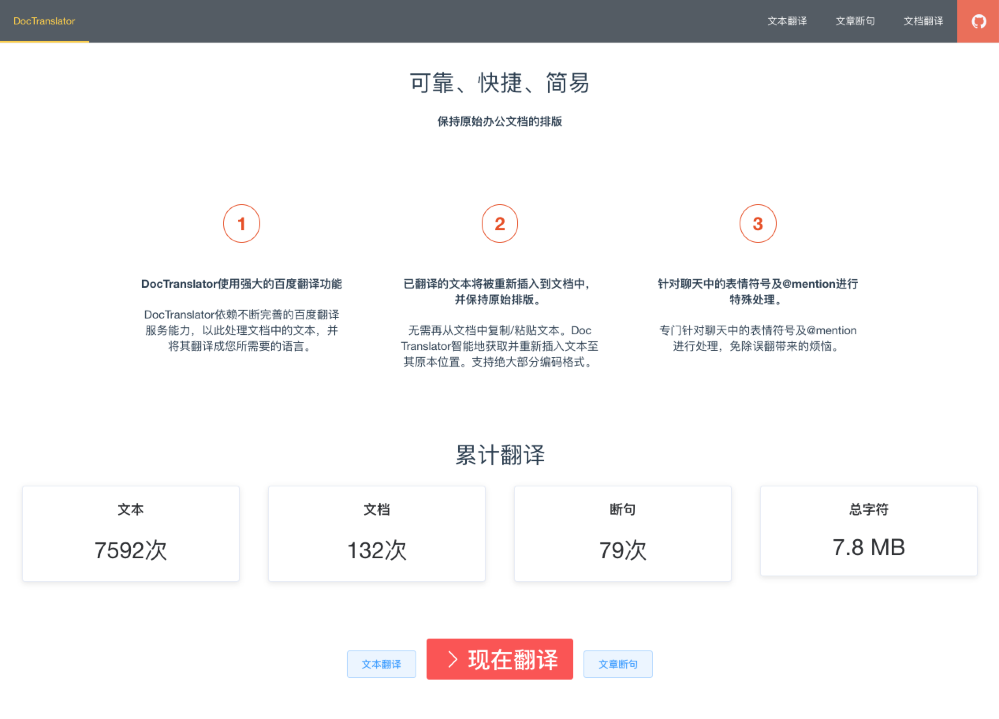
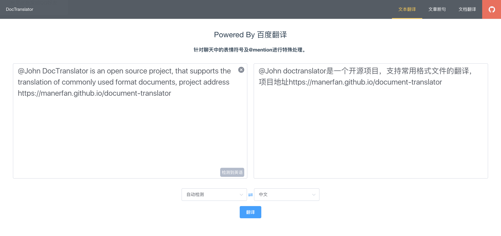
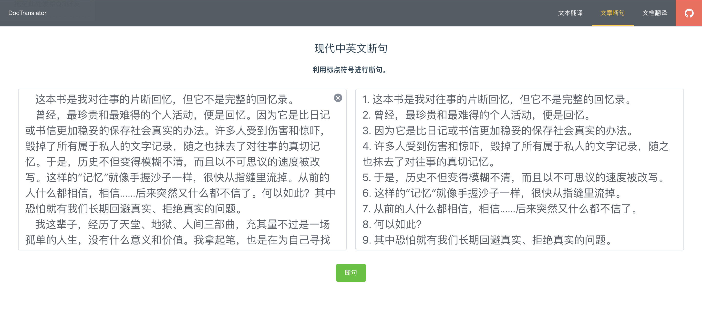
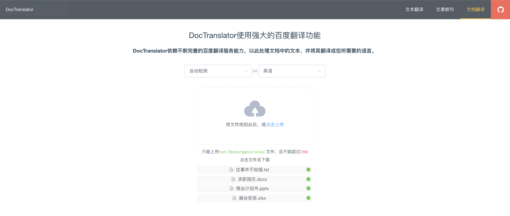
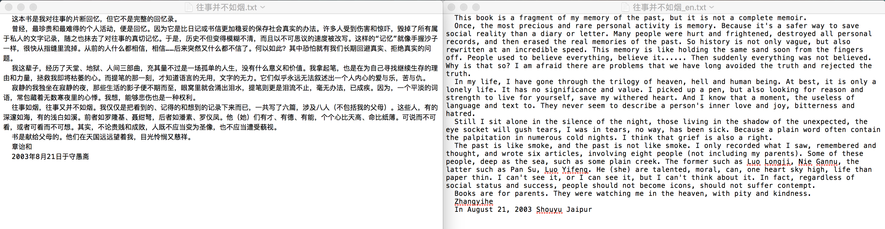
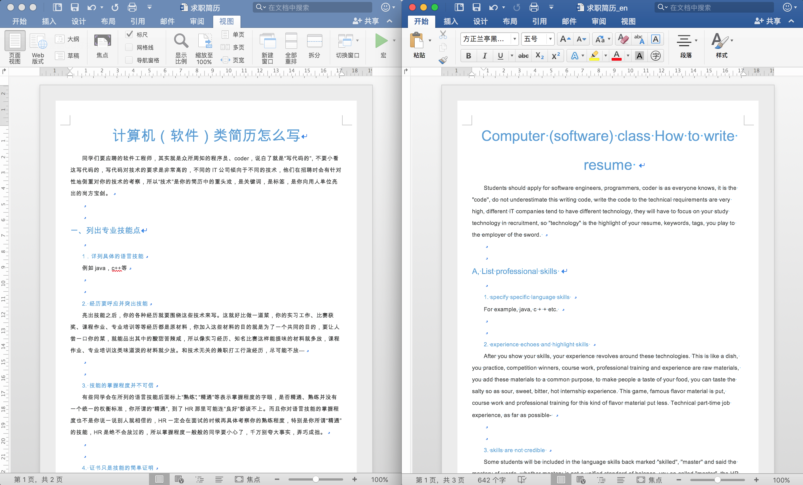
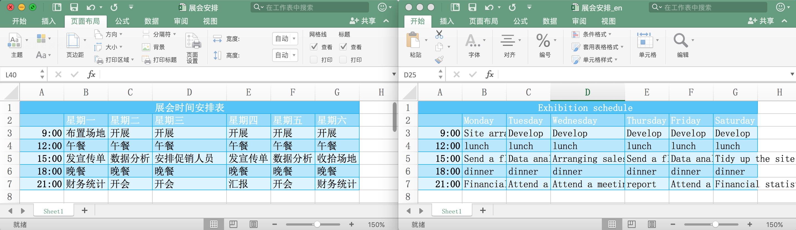
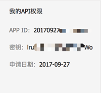

## DocTranslator

使用强大的[百度翻译](http://api.fanyi.baidu.com/)功能，依赖不断完善的百度翻译服务能力，以此处理文档中的文本，并将其翻译成您所需要的语言。

智能地获取并重新插入文本至其原本位置。已翻译的文本将被重新插入到文档中，并保持原始排版，无需再从文档中复制/粘贴文本。支持绝大部分编码格式。

专门针对聊天中的表情符号及@mention进行处理，免除误翻带来的烦恼。

项目地址 [GitHub](https://github.com/manerfan/document-translator)， 欢迎 STAR 欢迎 FORK 欢迎 PR

### 文本翻译

专门针对聊天中的表情符号及@mention进行处理。

### 文章断句

使用标点符号进行断句，对文档翻译进行更精准的控制。

### 文档翻译

支持常用格式文档，保留原始文档排版及编码。

#### TXT文档

#### DOCX文档

#### XLSX文档

#### PPTX文档

---

### 申请百度翻译API服务

申请地址[百度翻译开放平台](http://api.fanyi.baidu.com/)，申请后记录appid及appsecret

### 下载运行

下载并解压 [translator-server-1.1.0-beta.1.zip](https://github.com/manerfan/document-translator/releases/download/v1.1.0-beta.1/translator-server-1.1.0-beta.1.zip)

将百度翻译平台appid及appsecret替换到<code>translator-server.conf</code>文件`RUN_ARGS`属性中。

执行 `./translator-server.jar start`

浏览器访问 http://localhost:8001

#### 修改服务端口

`RUN_ARGS`属性增加参数 --server.port=***80***

#### 修改服务数据目录

服务数据默认存储在`/data/document-translator`目录中，`RUN_ARGS`中增加参数 --server.data.dir=***[expected path]***

#### 安装为服务

详见 [Install Spring Boot applications](https://docs.spring.io/spring-boot/docs/current/reference/html/deployment-install.html#deployment-service)

---

### 源码编译

项目地址 [document-translator](https://github.com/manerfan/document-translator)

所需环境：

1. JDK 1.8+
2. Gradle 4.2+
3. NodeJS 6.9+

clone源码`git clone https://github.com/manerfan/document-translator.git `

#### 调试

项目根目录执行`gradle :translator-server:bootRun  `启动后台服务

项目根目录执行`gradle :translator-ui:run`启动前端页面

浏览器访问 http://localhost:3000

#### 编译

项目根目录执行`gradle clean :translator-ui:buildUI build -x test`

#### 版本历史

[2018-01-01] v1.1.0-beta.1
1. kotlin重构

[2017-11-05] v1.0.0-beta.1
1. 支持文本翻译
2. 支持文章断句
3. 支持txt、docx、xlsx、pptx文档翻译
 